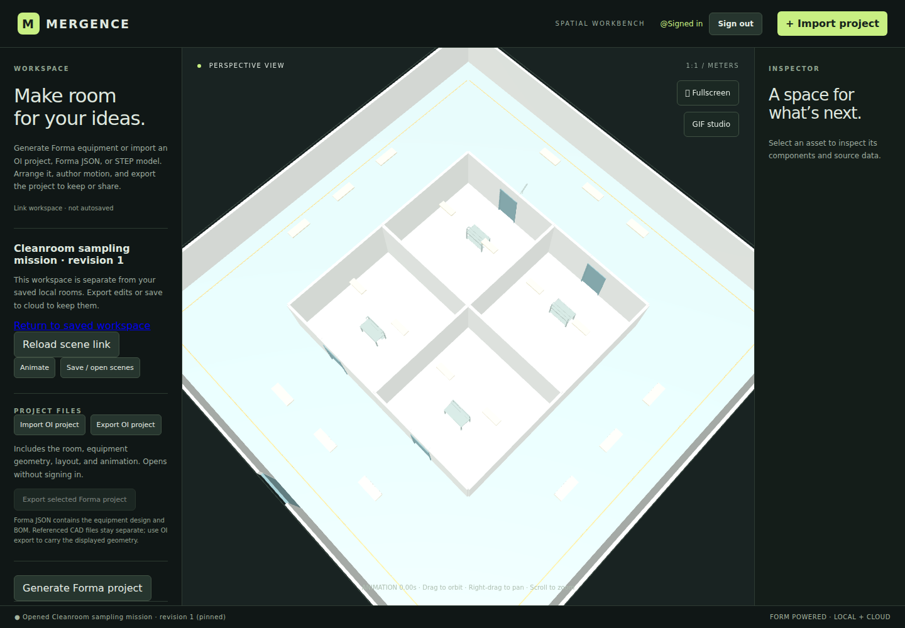
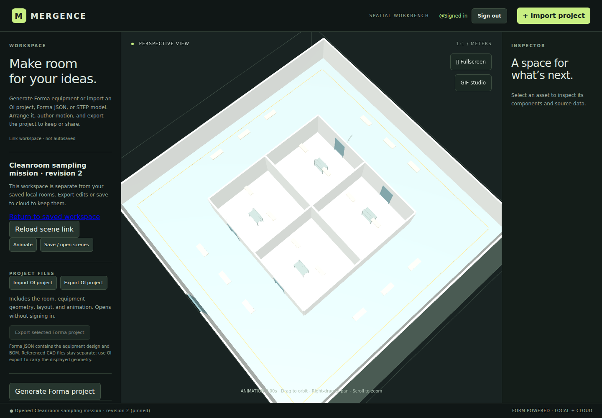
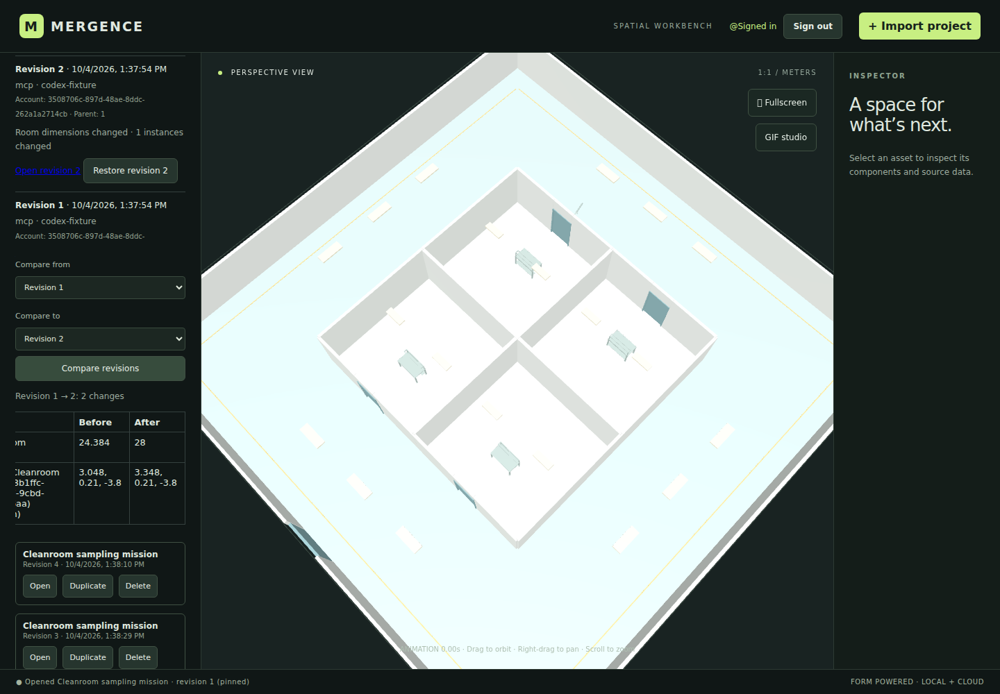
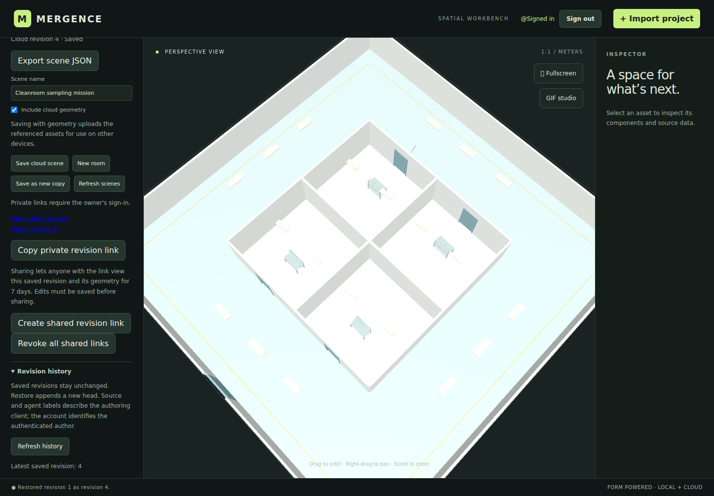

# Issue #62: scene workflow verification

Verified on 2026-10-04 against main `8c0031f117fdf6948fae11b6cc95c5191995d7e9`, with the extended browser regression in this change.

The complete local workflow passes: a typed MCP request creates a scene, the returned revision URL renders it, an MCP update creates a new revision, and the workbench compares and restores that same scene. Restore appends a new head and preserves the earlier snapshots and revision URLs.

## Evidence

These are real 1440 × 1000 browser screenshots from the authored `codex` fixture. That label describes the deterministic test client, not a native Codex session or a live model call. The test runs the real stdio MCP server, workbench, and database migrations against local PGlite plus fixture Auth/Storage.

| Step | Verified result |
| --- | --- |
| Create and open | Revision 1 loads all six instances and immutable geometry; the robot animation runs. |
| Update | Revision 2 changes width from 24.384 m to 28 m and Desk 2 X from 3.048 m to 3.348 m. |
| Compare | The history UI reports the room-width and desk-position changes. Its table scrolls horizontally in the sidebar; the screenshot shows the before/after columns. |
| Restore | Revision 1 becomes new head revision 4, after the replay check created revision 3. Placements, geometry references and the complete animation match revision 1. |
| Reopen original | The original URL still loads revision 1. All previous revision documents remain identical. |

### Created revision 1



### Updated revision 2



### Compare revisions 1 and 2



### Restore revision 1 as revision 4



## Verification commands

All passed with Chromium 153 selected through `ASTRA_CHROME_PATH`:

```sh
npm run build
npm run test:project-files-browser
npm run test:mcp-scenes-browser
npm run test:scene-history-browser
npm run test:scene-links-browser
npm run test:mcp-agent-workflows-browser
```

The cross-agent test exercises the authored Grok, ChatGPT, and Codex profiles, including their transport/result variations. Each now goes through compare and restore after create/update/open. The surrounding suites cover stale writes and restores, owner/anonymous access, shared-link revocation, local-draft preservation, exact geometry-version loading, migration backfill, and sanitized results.

CI publishes screenshots for all three profiles as `mcp-workflow-browser-evidence`. Locally, set `MCP_WORKFLOW_EVIDENCE_DIR` to choose an evidence directory. See the [walkthrough](mcp-agent-workflows.md) for reproduction and persistent setup.

## Remaining live verification

This run made no live Supabase or LLM calls and deployed no infrastructure. The verification environment lacks access to the configured OI Supabase project and an authenticated OI owner session. Fixture success does not establish that the live migrations, OAuth redirects, private Storage policies, or shared-link function are deployed correctly.

With access to the intended OI project and an owner session, the remaining step is to repeat create/open/update/compare/restore against that environment, then check a shared revision link in a signed-out browser if sharing is in scope. The repo supplies local stdio; a remote-only MCP host requires a separate trusted transport adapter. Native-client compatibility and the original Windows/OpenCode report in [#55](https://github.com/caid-technologies/Open-Industries/issues/55) are not claimed by these fixtures.
