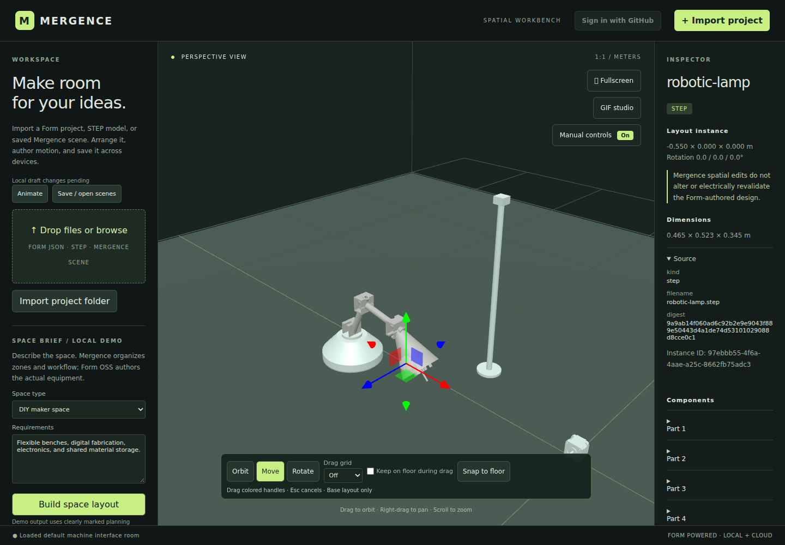
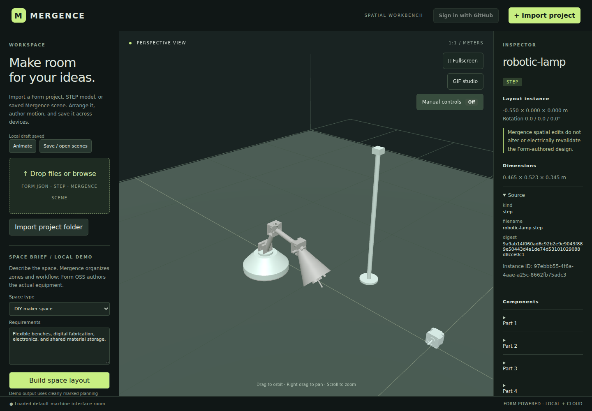
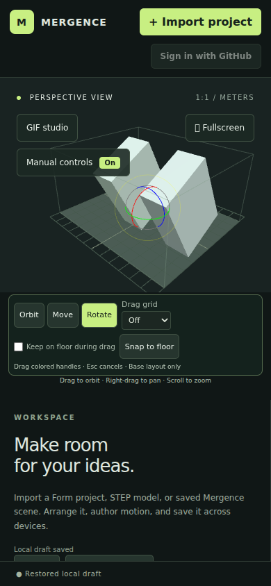
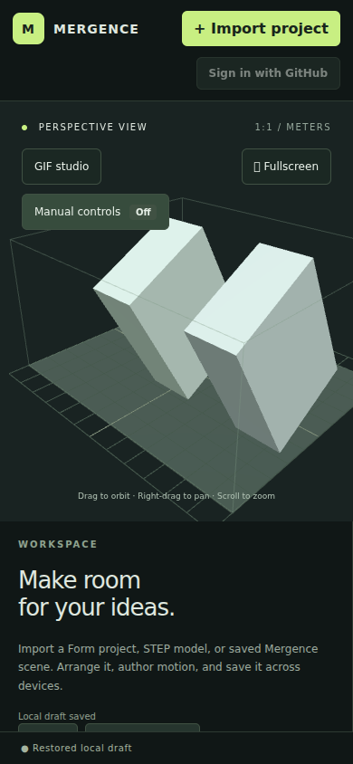
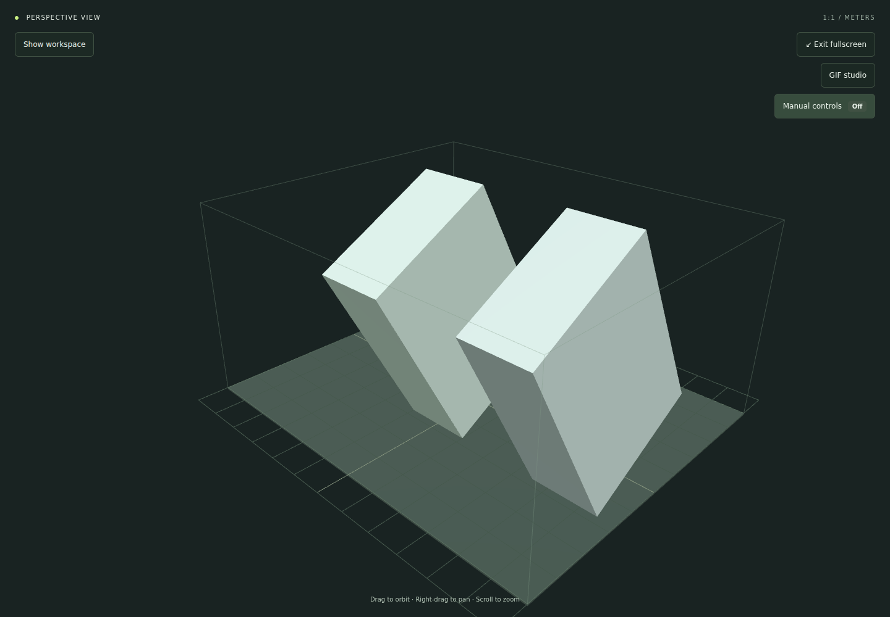

# Room layout editing

Use the **Manual controls · On/Off** switch in the viewport to show or hide the layout toolbar, transform handles, and numeric base-transform panel. Turning it off cancels any unfinished drag without changing the scene or undo/redo history. Orbit, pan, zoom, selection, and animation playback remain available. Turning it back on starts in Orbit mode; choose Move or Rotate to edit again. The preference is remembered in this browser when local storage is available, including after reload, and the switch remains accessible on mobile and in fullscreen. This is a layout UI preference, not a read-only workspace or permission setting.

Select an instance in Scene collection or click its geometry, then choose **Move** or **Rotate** in the viewport. Drag the colored world-axis handles (X red, Y green, Z blue). Drag elsewhere to orbit; use right-drag to pan and the wheel to zoom. **Orbit** hides the handles.

Position fields use meters and rotation fields use degrees around X/Y/Z. Fields and measurements update during a drag. Releasing commits one undo step; **Escape**, losing window focus, or a cancelled pointer restores the previous pose. Undo/redo also supports numeric edits, duplication, and deletion.

**Drag grid** rounds translation to the selected spacing in meters, relative to the room origin. **Keep on floor during drag** keeps the lowest transformed geometry vertex at Y = 0 during movement and rotation. **Snap to floor** performs that adjustment once. Floor contact takes priority over vertical grid spacing and preserves X/Z. Numeric edits remain exact and do not automatically snap.

Base bounds show the rotated geometry's world-axis dimensions, floor clearance, and instance origin in meters. The room is centered on X/Z with Y up; a notice identifies geometry extending outside it. Measurements do not certify collision clearance. Missing assets show placeholder measurements and cannot use drag/floor tools until repaired.

Transforms edit individual instance poses without modifying shared source geometry. These tools edit the base layout: choosing Move or Rotate stops animation preview and returns to it. Author motion in the timeline separately. GIF Studio disables viewport dragging while open.

## Screenshots

Actual browser captures from `npm run test:layout-browser`. Desktop uses the bundled machine room; mobile and fullscreen use the suite's isolated layout fixture.

Manual controls on: Move handles and the layout toolbar are visible.

Manual controls off: the handles, toolbar, and numeric base-transform panel are hidden while camera navigation stays available.

| Mobile: on | Mobile: off |
| --- | --- |
|  |  |

